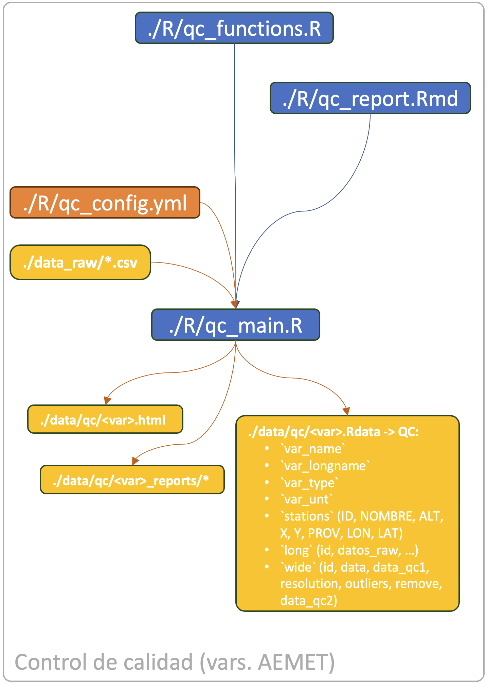

#  quality_control

## Description

An R script used to process climate data from AEMET's "Banco Nacional de Datos del Clima" (BNDC) raw files, to be used within CSIC's PTI+ Clima projects. The process performs a series of quality control checks, flags suspect data, and removes it according to a set of rules. The script also prepares the data for further processing within the LCSC data flow.

The code includes a `main.R` file, which sources a series of files: a configuration file `config.yml` with particularities of how to process each target variable; a functions `functions.R` file with the necessary functions to run the process; a markdown `report.Rmd` file, which is used to produce a global report for the process.

As a result, the script generates an `.Rdata` file for each processed variable. This file contains one single object, containing all the necessary items (station metadata, data matrix, configuration options, etcetera). All scripts generate a general report, and most steps also generate individual reports (one file for each data series / station).

The image below summarises the flow of data and code:



This image relates the variables in AEMET's BNDC to the variables used in the PTI's process:


This image summarizes the processes undergone by the PTI variables:


## Use instructions

From the terminal, run `Rscript R/main.R <var>`, where \<var\> is a named configuration which is read from configuration file `config.yml`. This indicates the variable to process.

## Configuration files

Note that the AEMET's variables are different from the PTI ones, and the configuration is made per variable. There is a field that maps the AEMET's to the PTI variables. The configuration files is formatted as YAML, and can be edited with a text editor.

**qc_config.yml** – Configuration options used during the quality control step. There are options for each variable set in AEMET's raw data files. Variable sets are contain variables that are expressed in the same units. This is a list of the named configurations in the configuration file (there is one for each variable set):

-   `pluvio`: daily cumulative precipitation (one variable: "P").
-   `canmaxpcp`: maximum n-minutes precipitation intensity (7 variables: "PMAX10", "PMAX20", "PMAX30", "PMAX60", "PMAX2H", "PMAX6H", "PMAX12H").
-   `humedad`: relative humidity, synoptic observations plus two daily maxima (6 variables: "HU00", "HU07", "HU13", "HU18", "HUMAX", "HUMIN").
-   `presion`: air pressure, synoptic observations plus two daily maxima (6 variables: "PRES00", "PRES07", "PRES13", "PRES18", "PRESMAX", "PRESMIN").
-   `viento_1`: wind speed, synoptic observations plus one daily maxima (5 variables: "VEL_00", "VEL_07", "VEL_13", "VEL_18", "R_MAX_VEL").
-   `viento_2`: daily wind travel (two variables: "REC24", "REC77").
-   `viento_3`: wind speed, synoptic observations plus one daily maxima (5 variables: "DIR_00", "DIR_07", "DIR_13", "DIR_18", "R_MAX_DIR").
-   `insolacion`: total daily sun hours (one variable: "TOTSOL").
-   `radiacion`: daily cumulative radiation (three variables: "RDIRDIA", "RDIFDIA", "RGLODIA").

For each named option, the configuration file contains the following items:

```{=html}
  dir:
    input: input directory (where the raw data are stored)
    output: output directory (where to put the resulting files)
  cores: number of cores to use in the process (not currently used)
  do:
    verbose: use verbose output
    trial: use trial mode (only for debugging or demonstration; uses only the first 100 data)
    export: export results to file
    indiv_reports: produce individual reports per series
  file:
    type: file type (each variable is a type)
    source: currenty, only "AEMET"
  var:
    names: name(s) of the variable(s) within the AEMET's raw data files
    longnames: long name(s) of the variable(s)
    units: unit(s) of the variable
    limits:
      lower: reasonable or physical lower limit for the variable(s) data
      upper: reasonable or physical upper limit for the variable(s) data
```

